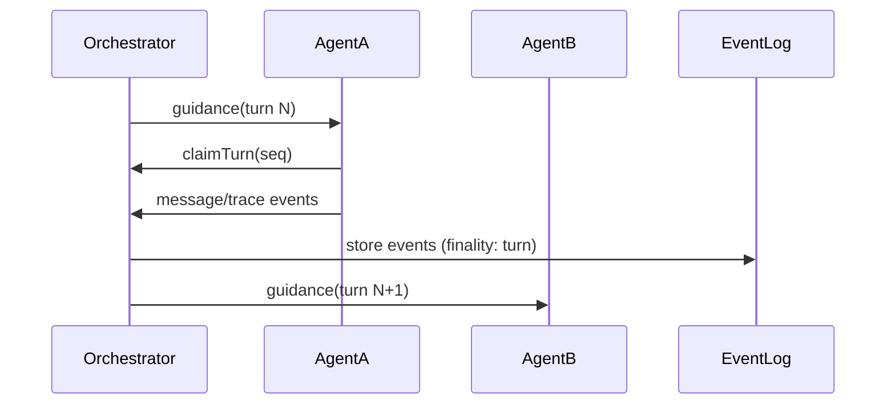
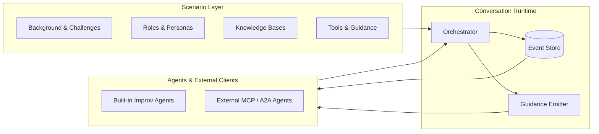

# 💬 Conversational Interop Reference Stack

A transparent, extensible simulation and orchestration environment for **conversation‑driven interoperability** between systems, teams, and tools in complex domains.

---

## 💡 What This Stack Lets You Do

This reference stack is designed so **any developer** can plug in their own conversational agent and have it interact naturally with simulated agents in **nearly any scenario you can design**.

We provide:

- **Configurable scenarios**: define the “world” — roles, goals, private records, and actions (“tools”) for each agent.
- **Tool synthesis** (“the Oracle”): produces believable results from those tools without real backend APIs.
- **Transparent orchestration**: your agent just sees messages, turns, and tool responses like it would with a real counterparty.

Your agent **never needs to know it’s in a simulation** — conversations look real from its perspective.

You can connect in multiple ways:

- **External MCP client** — Your agent connects *to* the orchestrator.
- **External MCP server** — The orchestrator connects to *your* agent.
- **External A2A clients & servers** — For emerging agent‑to‑agent protocol standards.
- **Or none at all** — run built‑in **improv agents** and simply watch them talk.

---

## 🌍 Background & Motivation

In many cross‑organization workflows, information exchange fails not for lack of transport, but because:

- **Integrations are brittle** — workflows break when business rules or local assumptions change.
- **Key context is missing** — data is structurally valid but incomplete for the receiver's purpose.
- **Humans fill the gaps** — requiring calls, emails, or faxes to clarify.

**Examples where conversation helps**:
- **Prior authorization** — Not just “yes/no”, but clarifying criteria, providing supporting documents.
- **Specialty appointment booking** — Not just finding a date, but confirming eligibility for a slot.
- **Clinical trial enrollment** — Determining eligibility through back‑and‑forth Q&A.
- **Disease registry reporting** — Negotiating missing or ambiguous case details.

### Conversation-Driven Exchange

Here, autonomous or semi‑autonomous **agents** act for each party.  
The conversation — natural language plus optional structured data attachments — works like an **email chain** the parties stay “in” until they work things out.

This stack makes it practical and testable:

- **Glass‑box runs** where you see every message, thought, simulated action.
- **Scenario‑based control** over context, roles, and rules.
- **Turn‑based orchestration** ensuring order and replayability.

---

## 🎯 Goals

1. **Glass‑box simulation** — See every decision, message, and tool call in context.
2. **Orderly orchestration** — Deterministic turn control and fair scheduling.
3. **Scenario‑driven testing** — Rich setups to test nuanced flows.
4. **Interop readiness** — MCP today, A2A tomorrow.
5. **Rapid prototyping** — Define an agent’s persona, private KB, and tools in minutes.

---

## 🛠 Key Features

- **Conversation**: Container for the whole exchange (like a shared email chain).
- **Scenario**: Playbook for a simulated world with roles & goals.
- **Tool Synthesis**: Oracle‑driven plausible action results.
- **Immutable Event Log**: Replayable record of all events.
- **Turn Claiming**: Ensures only one active agent at a time.
- **Attachment Handling**: Store/reuse large or structured artifacts.
- **Pluggable Scheduling**: Choose who speaks next.
- **CLI Demos**: Watch or run simulations locally.

---

## 🔍 Core Concepts

### 1. Conversations — *The session container*

**Concept:**  
A Conversation is the bounded “room” agents stay in until the job is done — like an email thread for coordination.

**Behavior:**
- **Roster** — IDs, type (internal/external), config.
- **Lifecycle** — Starts at turn 0, ends on explicit finality.
- **Scenario link** — Often tied to a scenario for simulation.

---

### 2. Scenarios — *Realistic improv setup*

**Concept:**  
Define structured starting conditions:
- Shared **background** and **challenges**.
- Distinct **roles** with identity, situation, goals, private KB, tools, and persona.
- Optional starter line.

Repeatable, comparable runs in the same “world”.

---

### 3. Tool Synthesis (“Oracle”)

Simulates tool/API calls:
- Input: Tool + params.
- Context: Scenario, KBs, history.
- Output: `{ reasoning, output }` plausible in-world.

---

### 4. Orchestrator

Keeps order:
- Emits `guidance` naming next agent.
- Requires `claimTurn` before acting.
- Expiry triggers next candidate.

---

### 5. Event Log

Immutable ledger:
- Types: Message / Trace / System.
- Addressing: turn, event, global `seq`.
- Finality: none / turn / conversation.

---

### 6. Attachments

Store large or structured content once, reference via `docId`.

---

### 7. Turn Claiming

Ensures one actor per turn, prevents collisions.

---

## 📡 Clients & Data Patterns

**Connect as:**
- Participant (contribute turns)
- Observer (view only)

**Patterns:**
1. Snapshot + Follow — Fetch then live subscribe.
2. Continuous — Always-subscribe live.
3. Resilient — Resume after `seq` gap.

### Hydration

Before acting:
- Merge scenario data, live roster, and full event log into a single snapshot for your agent.

---

## 📊 Diagrams

### Concept Map
```mermaid
flowchart TB
    Scenario[Scenario\n- background, roles, KBs, tools]
    Conversation[Conversation Instance\n- roster, event log, config]
    ToolCall[Tool Call]
    Oracle[Oracle Synthesis\n(fictional but plausible outputs)]
    EventLog[Event Log]
    Hydration[Hydrated Snapshot\n(scenario + live state + events)]
    Agent[Agent / Client App\n(internal or external MCP/A2A)]

    Scenario --> Conversation
    Conversation --> ToolCall
    ToolCall --> Oracle --> EventLog
    Conversation --> EventLog
    EventLog --> Hydration --> Agent
    Conversation --> Hydration
```

---

### Turn Lifecycle


---

### Architecture Overview


---

## 📂 Project Structure

```
src/
  agents/         # Agent logic
  cli/            # CLI demos
  db/             # SQLite schema & accessors
  llm/            # LLM providers (mock & real)
  lib/            # Utilities
  server/         # Hono server, orchestrator, RPC
  types/          # Shared types
tests/            # Unit and integration tests
```

---

## 🚀 Running Locally

```bash
bun install
bun run dev
```

Example local sim with built‑in agents:
```bash
bun run src/cli/run-sim-inproc.ts
```

---

You can now:
- **Plug in your own agent** (MCP or A2A) as participant or observer.
- **Run ours** and watch believable, contextual conversations unfold.
