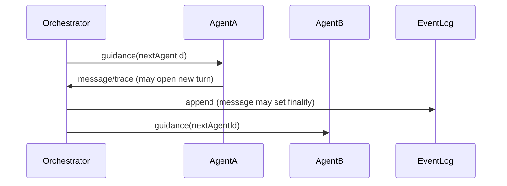
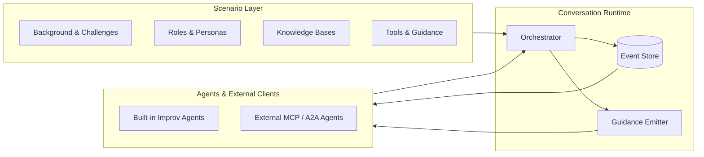

# 💬 Conversational Interop Reference Stack

A transparent, extensible simulation and orchestration environment for **conversation‑driven interoperability** between systems, teams, and tools in complex domains.

---

## 💡 What This Stack Lets You Do

This reference stack is designed so **any developer** can plug in their own conversational agent and have it interact naturally with simulated agents in **nearly any scenario you can design**.

We provide:

- **Configurable scenarios**: define the “world” — roles, goals, private records, and actions (“tools”) for each agent.
- **Tool synthesis** (“the Oracle”): produces believable results from those tools without real backend APIs.
- **Transparent orchestration**: your agent just sees messages, turns, and tool responses like it would with a real counterparty.

Your agent **never needs to know it’s in a simulation** — conversations look real from its perspective.

You can connect in multiple ways:

- **External MCP client** — Your agent connects *to* the orchestrator.
- **External MCP server** — The orchestrator connects to *your* agent.
- **External A2A clients & servers** — For emerging agent‑to‑agent protocol standards.
- **Or none at all** — run built‑in **improv agents** and simply watch them talk.

---

## 🌍 Background & Motivation

In many cross‑organization workflows, information exchange fails not for lack of transport, but because:

- **Integrations are brittle** — workflows break when business rules or local assumptions change.
- **Key context is missing** — data is structurally valid but incomplete for the receiver's purpose.
- **Humans fill the gaps** — requiring calls, emails, or faxes to clarify.

**Examples where conversation helps**:
- **Prior authorization** — Not just “yes/no”, but clarifying criteria, providing supporting documents.
- **Specialty appointment booking** — Not just finding a date, but confirming eligibility for a slot.
- **Clinical trial enrollment** — Determining eligibility through back‑and‑forth Q&A.
- **Disease registry reporting** — Negotiating missing or ambiguous case details.

### Conversation-Driven Exchange

Here, autonomous or semi‑autonomous **agents** act for each party.  
The conversation — natural language plus optional structured data attachments — works like an **email chain** the parties stay “in” until they work things out.

This stack makes it practical and testable:

- **Glass‑box runs** where you see every message, thought, simulated action.
- **Scenario‑based control** over context, roles, and rules.

---

## 🚀 Quick Start

```bash
# Install dependencies
bun install

# Start the server
bun run dev

# Run a demo (in another terminal)
bun run src/cli/demo-browserside-scenario.ts
```

## 🧭 Control vs Data Plane

This codebase cleanly separates how agents are managed (control plane) from how they talk (data plane).

- Control plane: start/stop and inspect agents and conversations
  - In-process: `InProcessControl` (server only)
  - WebSocket: `WsControl` (stateless, one-shot calls)
  - Methods: `createConversation`, `getConversation`, `ensureAgentsRunningOnServer`, `stopAgentsOnServer`

- Data plane: agents exchange events through the orchestrator
  - In-process transport: `InProcessTransport`
  - WebSocket transport: `WsTransport`
  - Unified entry point for execution: `startAgents({ transport, providerManager, turnRecoveryMode: 'restart' })`

Minimal WS JSON-RPC (under `/api/ws`):
- Control: `createConversation`, `getConversation`, `ensureAgentsRunningOnServer`, `stopAgentsOnServer`, `clearTurn`
- Data: `sendMessage`, `sendTrace`, `subscribe`, `unsubscribe`, `getEventsPage`

Scenario CRUD is HTTP-only under `/api/scenarios`; conversations list is HTTP under `/api/conversations`.

## 🚦 Launch Recipes

- Server-managed:
  - Control: `createConversation(meta)`, `ensureAgentsRunningOnServer(conversationId)`
  - Observe: `subscribe` with optional `sinceSeq`, or poll `getEventsPage`
  - Resume: server persists `autoRun` in conversation metadata and re-ensures on boot

- Client-managed:
  - Control: `createConversation(meta)` via `WsControl`
  - Data: `startAgents({ conversationId, transport: new WsTransport(wsUrl), turnRecoveryMode: 'restart' })`
  - Resume: on reload, call `startAgents` again; strict alternation + restart recovery ensure safety

See `src/cli/demo-browserside-scenario.ts` for a client-managed example.

---

## 🎯 Goals

1. **Glass‑box simulation** — See every decision, message, and tool call in context.
2. **Orderly orchestration** — Deterministic turn control and fair scheduling.
3. **Scenario‑driven testing** — Rich setups to test nuanced flows.
4. **Interop readiness** — MCP today, A2A tomorrow.
5. **Rapid prototyping** — Define an agent’s persona, private KB, and tools in minutes.

---

## 🛠 Key Features

- **Conversation**: Container for the whole exchange (like a shared email chain).
- **Scenario**: Playbook for a simulated world with roles & goals.
- **Tool Synthesis**: Oracle‑driven plausible action results.
- **Immutable Event Log**: Replayable record of all events.
- **Guidance Scheduling**: Orchestrator emits guidance(nextAgentId); CAS preconditions ensure safe turn opens.
- **Attachment Handling**: Store/reuse large or structured artifacts.
- **Pluggable Scheduling**: Choose who speaks next.
- **CLI Demos**: Watch or run simulations locally.

---

## 🔍 Core Concepts

### 1. Conversations — *The session container*

**Concept:**  
A Conversation is the bounded “room” agents stay in until the job is done — like an email thread for coordination.

**Behavior:**
- **Roster** — IDs, type (internal/external), config.
- **Lifecycle** — Starts at turn 0, ends on explicit finality.
- **Scenario link** — Often tied to a scenario for simulation.

---

### 2. Scenarios — *Realistic improv setup*

**Concept:**  
Define structured starting conditions:
- Shared **background** and **challenges**.
- Distinct **roles** with identity, situation, goals, private KB, tools, and persona.
- Optional starter line.

Repeatable, comparable runs in the same “world”.

---

### 3. Tool Synthesis (“Oracle”)

Simulates tool/API calls:
- Input: Tool + params.
- Context: Scenario, KBs, history.
- Output: `{ reasoning, output }` plausible in-world.

---

### 4. Orchestrator

Keeps order:
- Emits `guidance` naming next agent.
- Agents open new turns by posting a `message` or `trace`; when opening, clients should respect a CAS precondition (`lastClosedSeq`) to avoid races.
- Policies choose the next agent; guidance may be emitted after a turn-ending message.

---

### 5. Event Log

Immutable ledger:
- Types: Message / Trace / System.
- Addressing: turn, event, global `seq`.
- Finality: none / turn / conversation.

---

### 6. Attachments

Store large or structured content once, reference via `docId`.

---

### 7. Guidance & Turn Safety

The orchestrator coordinates turns by emitting `guidance` events that name the suggested next agent. Turn validation happens server‑side; clients do not need client‑side CAS. For resilience, agents use restart recovery: if they rejoin mid‑turn, they first send `clearTurn`, then proceed as if starting the turn fresh.

---

## 📡 Clients & Data Patterns

**Connect as:**
- Participant (contribute turns)
- Observer (view only)

**Patterns:**
1. Snapshot + Follow — Fetch then live subscribe.
2. Continuous — Always-subscribe live.
3. Resilient — Resume after `seq` gap.

### Hydration

Before acting:
- Merge scenario data, live roster, and full event log into a single snapshot for your agent.

- System events live on a meta lane at turn `0` and do not block/close conversational turns `1..N`.

---

## 📊 Diagrams

### Concept Map
```mermaid
flowchart TB
    Scenario[Scenario\n- background, roles, KBs, tools]
    Conversation[Conversation Instance\n- roster, event log, config]
    ToolCall[Tool Call]
    Oracle[Oracle Synthesis\n(fictional but plausible outputs)]
    EventLog[Event Log]
    Hydration[Hydrated Snapshot\n(scenario + live state + events)]
    Agent[Agent / Client App\n(internal or external MCP/A2A)]

    Scenario --> Conversation
    Conversation --> ToolCall
    ToolCall --> Oracle --> EventLog
    Conversation --> EventLog
    EventLog --> Hydration --> Agent
    Conversation --> Hydration
```

---

### Turn Lifecycle


---

### Architecture Overview


---

## 📂 Project Structure

```
src/
  agents/         # Agent logic
  cli/            # CLI demos
  db/             # SQLite schema & accessors
  llm/            # LLM providers (mock & real)
  lib/            # Utilities
  server/         # Hono server, orchestrator, RPC
  frontend/       # Watch UI for local iteration
  types/          # Shared types
tests/            # Unit and integration tests
```

---

## 🚀 Running Locally

```bash
bun install
bun run dev              # API + WS (PORT or 3000)
```

Optional:
- `bun run dev:frontend` — serves watch UI at http://localhost:3001 (reads WS from 3000)
- `bun test` / `bun run test:watch` — run tests
- `bun run typecheck` — strict TypeScript checks
- `bun run clean` — remove local SQLite artifacts (`data.db*`)

Environment (.env; keys optional unless using non‑mock providers):
- `DB_PATH` — default `dbs/data.db` (auto-created directory)
- `PORT`, `IDLE_TURN_MS`
- `DEFAULT_LLM_MODEL` — e.g., `gemini-2.5-flash` or `openai/gpt-oss-120b:nitro`
- `DEFAULT_LLM_PROVIDER` — `google | openrouter | mock` (optional; defaults to `mock`)
- `GEMINI_API_KEY` (Google Gemini) and/or `OPENROUTER_API_KEY`
- Note: `DEFAULT_LLM_MODEL` alone works — provider is auto‑detected from the model name; if unknown, specify `DEFAULT_LLM_PROVIDER` explicitly.

Data defaults to `dbs/data.db` (gitignored) and the `dbs/` folder is created automatically when the DB opens.

Quick examples:
```bash
# Use a custom DB file under ./dbs
DB_PATH=dbs/my-run.db bun run dev

# Set default model only (provider auto-detected from model)
DEFAULT_LLM_MODEL=gemini-2.5-flash GEMINI_API_KEY=... bun run dev

# Explicit provider + model via OpenRouter
DEFAULT_LLM_PROVIDER=openrouter DEFAULT_LLM_MODEL=openai/gpt-oss-120b:nitro OPENROUTER_API_KEY=... bun run dev
```

### CLI Demos (working examples)

- Create/join a simple conversation as an external agent (Echo by default):
  ```bash
  bun run src/cli/ws-convo.ts --agent-id you --create --initial-message "Hello"
  ```
- Start two internal echo agents and watch events:
  ```bash
  bun run src/cli/ws-internal-agents.ts --agent-id agent-alpha --title "Internal Agents Test"
  ```
- Join an existing conversation:
  ```bash
  bun run src/cli/ws-join-agent.ts --conversation-id 1 --agent-id you --agent-class EchoAgent
  ```
- Run a scenario by ID (register one via HTTP or RPC first):
  ```bash
  bun run src/cli/ws-scenario.ts --scenario-id my-scenario --agent-id agent-1
  ```
- Auto‑run demo with resume:
  ```bash
  bun run src/cli/ws-run-auto-convo.ts --agent1-id alpha --agent2-id beta
  ```

All WS CLIs default to `ws://localhost:3000/api/ws`; override with `--url`.

### Watch UI

Lightweight watch/debug UI at `src/frontend/watch/`:

```bash
bun run dev:frontend   # serves http://localhost:3001
```

#### Keyboard Shortcuts (Watch)

- j / k: Move selection down / up (list)
- Enter: Open selected conversation
- /: Focus list search
- h / l: Focus list / details
- r: Refresh list / reconnect details
- t: Toggle traces (details pane)
- a: Toggle autoscroll (details pane)
- ?: Toggle shortcuts help overlay

---

You can now:
- **Plug in your own agent** (MCP or A2A) as participant or observer.
- **Run ours** and watch believable, contextual conversations unfold.

---

## 🔌 HTTP API (summary)

- `GET /api/health`
- Scenarios (CRUD):
  - `GET /api/scenarios`
  - `GET /api/scenarios/:id`
  - `POST /api/scenarios`
  - `PUT /api/scenarios/:id`
  - `DELETE /api/scenarios/:id`
- Attachments:
  - `GET /api/attachments/:id` — metadata
  - `GET /api/attachments/:id/content` — raw content with `Content-Type`
- LLM helper:
  - `GET /api/llm/providers` — available providers
  - `POST /api/llm/complete` — synchronous completion (validates body)

## 🔗 WebSocket JSON‑RPC

Endpoint: `ws://<host>:<port>/api/ws`

Methods (subset):
- Health: `ping`
- Conversations: `createConversation`, `listConversations`, `getConversation`, `getHydratedConversation`, `getEventsPage`
- Events: `sendMessage`, `sendTrace`
- Subscriptions: `subscribe` (supports `filters.types`/`filters.agents` and `sinceSeq` backlog), `unsubscribe`, `subscribeAll`
- Scenarios: `listScenarios`, `getScenario`, `createScenario`, `updateScenario`, `deleteScenario`
- Orchestration helper: `runConversationToCompletion`

Notifications:
- `event` — unified event
- `guidance` — transient scheduling hints

CAS: When opening a new turn, internal clients include a CAS precondition (`lastClosedSeq`). External clients can follow the same pattern using `getConversation` and `getEventsPage` to derive state.

## 🗂️ Data Model Notes

- Events use a global `seq` (monotone) and `ts` with millisecond precision.
- Only `message` events may set `finality` to `turn` or `conversation`; `trace`/`system` must use `none`.
- System events are stored on turn `0` and do not affect turn openness.
- Message attachments are persisted in an `attachments` table; payloads are rewritten to references `{ id, docId?, name, contentType, summary? }`.

## 🧭 Scheduling Policy

- Default policy: strict alternation over `metadata.agents`; emits guidance for the next agent when a turn‑ending message arrives.
- Scenario‑aware policies are available; scheduling is pluggable.

## 🔁 Auto‑Run Resume

- Conversations marked with `metadata.custom.autoRun = true` will resume internal agent loops on server restart if recently updated; stale runs are skipped and the flag is cleared.

## 🔐 Security & Data

- Don’t commit `.env` or SQLite databases (`data.db*`).
- Prefer synthetic data; avoid real PHI/PII.
- Use `bun run clean` to reset local state quickly.

## ✅ Testing & Guarantees

- Tests validate millisecond timestamp precision and idempotency keys `(conversation, agentId, clientRequestId)`.
- Appending to a closed turn throws; only `message` can close a turn or conversation.

## 🧩 MCP Bridge (optional)

- Bridge endpoint: `/api/bridge/:config64/mcp` where `config64` is base64url‑encoded ConversationMeta.
- Diagnostic: `/api/bridge/:config64/mcp/diag` echoes parsed meta.
- Tools: `begin_chat_thread`, `send_message_to_chat_thread`, `get_updates`.
  - conversationId is string on the wire.
  - get_updates returns messages only; attachments are inlined with content.

## 📝 TODO / Future Improvements

### WebSocket Client Architecture Refactoring
- **Deduplicate WebSocket subscription logic**: Currently we have two separate implementations:
  - `WsEventStream` (used by agents via WsTransport → WsEvents) - async iteration pattern
  - `WsJsonRpcClient` (used by external.executor.ts) - callback pattern with built-in subscription
- Both handle WebSocket RPC subscriptions and push events but with different APIs
- Consider unifying into a single WebSocket client that can support both patterns
- Related files:
  - `src/agents/clients/event-stream.ts` (WsEventStream)
  - `src/agents/clients/ws.client.ts` (WsJsonRpcClient)  
  - `src/agents/runtime/ws.transport.ts` (WsTransport)
  - `src/agents/runtime/ws.events.ts` (WsEvents)
