# 💬 Banterop: A Testbed for Conversational Interoperability

This project provides a transparent, extensible environment for testing and developing autonomous AI agents. Its core purpose is to make it easy to create a high-fidelity, interactive, and inspectable **simulated agent** to act as a conversational partner for your **real agent**.

Hosted service: https://banterop.fhir.me

- Connect your MCP or A2A clients (Banterop hosts the room/server endpoint).
- Connect your MCP or A2A servers (Banterop provides a reference client UI).
- Pick from many built-in scenarios — or add and configure your own directly in the UI.

## The Vision: Language-First Interoperability in Healthcare

Traditional healthcare interoperability is powerful but often requires a lengthy pre-coordination phase where stakeholders negotiate common data formats, draft implementation guides, and stand up dedicated endpoints. This can be a barrier for resource-limited organizations and for workflows where requirements are dynamic and context is critical.

**Banterop explores a new paradigm: Language-First Interoperability.**

The core idea is simple: let AI agents, representing different organizations, communicate with each other in natural language to figure out what data they need, clarify ambiguities, and then provide that data in whatever form is required. This approach aims to:

-   **Shorten the pre-coordination phase** by allowing agents to dynamically negotiate the parameters of an exchange.
-   **Handle ambiguity and incomplete information** through conversational clarification, mirroring how humans solve these problems today.
-   **Bridge the gap** between natural language requests and structured data systems like FHIR.

This project is a testbed for this vision, providing a neutral ground where developers can bring their own agents to **banteroperate** with others in a rich, simulated environment.

## Why Banterop? The Perfect Test Partner for Your Agent

Developing a robust conversational agent is hard. Testing it is even harder, especially for complex, multi-turn workflows like prior authorization or clinical trial matching. You need a counterparty that is:

-   **Realistic**: Behaves according to a complex set of rules and has its own private knowledge.
-   **Dynamic**: Can handle ambiguity and negotiate, not just follow a rigid script.
-   **Inspectable**: Lets you see "inside its head" to understand why it's making certain choices.
-   **Controllable**: Allows you to intervene, guide, or even take over its side of the conversation.

**Banterop provides this test partner.** The simulated agents within Banterop are powered by detailed **Scenarios**, making it easy to create a reliable and realistic conversational partner for your real-world agent.

## The Banterop Architecture: A Testbed with Two Modes

You can use Banterop in two primary ways, depending on whether your agent acts as a client or a server. In both modes, the *simulated* side of the conversation is powered by our unique browser-based architecture, giving you full control and visibility.

1.  **Client Mode**: You bring an A2A/MCP **client**. Banterop provides the simulated server endpoint.
2.  **Server Mode**: You bring an A2A/MCP **server**. Banterop provides the simulated client to connect to you.

### The Browser as Your Control Panel (The "Flip Proxy" Magic)

Banterop uses the magic of the web to push the simulated agent's logic out of a black-box server and directly into your browser. The Banterop server acts as a lightweight **"flip proxy"**, creating a uniquely powerful and interactive testing loop. This architecture lets you see and control everything.

Here's how it works:

-   Whether your agent is a client or a server, it communicates with a stable endpoint provided by Banterop.
-   The Banterop server doesn't process the conversational logic itself. Instead, it **"flips"** incoming messages to your browser, which hosts the Banterop UI.
-   Inside your browser, the `PlannerHarness` (the simulated agent's brain) runs. It reads the message, consults its scenario-defined goals, private knowledge, and simulated tools, and decides on a response.
-   Crucially, because this logic runs in your browser, you can **watch its decisions in real-time**, inspect its internal state, pause execution, adjust its proposed responses, or even switch between automated planners and manual control.
-   Once a response is ready, it's sent back via the "flip proxy" through the Banterop server to your real agent.

This turns the simulated agent from an opaque endpoint into a transparent, interactive partner.

```mermaid
graph TB
    subgraph ClientMode ["🤖 Client Mode (You Bring the Client)"]
        ClientAgent[Your Agent<br/>A2A/MCP Client]
        BanteropServer[Banterop Server<br/>Stable Endpoint]
        ClientAgent -->|"Connects to"| BanteropServer
    end

    subgraph Browser ["🌐 Your Browser (The Control Panel)"]
        RoomApp[Room App UI]
        ClientAppUI[Client App UI]
        PlannerHarness[Planner Harness<br/>Simulated Agent Brain]
        SimulatedTools[Simulated Tools<br/>EHR Lookup, Policy Checks]
        KnowledgeBase[Knowledge Base<br/>Powers the Tools]
        
        RoomApp -.-> PlannerHarness
        ClientAppUI -.-> PlannerHarness
        PlannerHarness --> SimulatedTools
        SimulatedTools --> KnowledgeBase
    end

    subgraph ServerMode ["🖥️ Server Mode (You Bring the Server)"]
        ServerAgent[Your Agent<br/>A2A/MCP Server]
        BanteropClient[Banterop Client<br/>Connects to You]
        BanteropClient -->|"Connects to"| ServerAgent
    end

    BanteropServer <-->|"Flip Proxy"| RoomApp
    ClientAppUI <-->|"Drives"| BanteropClient

    style ClientMode fill:#d4edda,stroke:#155724
    style Browser fill:#fff3e0,stroke:#ef6c00
    style ServerMode fill:#e1f5fe,stroke:#0277bd 
```



---

## 🔌 Connecting Your Agent: A Developer's Guide

To interoperate with Banterop, you can implement a client or server using one of two fully supported protocols. Both are exposed for every Room created in the platform.

### Option 1: MCP (Model Context Protocol)

Connect your agent to our MCP endpoint using the **Streamable HTTP Transport**.

**Endpoint**: `/api/rooms/:roomId/mcp`

Your agent must support these three tools:

#### `begin_chat_thread`
-   **Description**: Starts a new conversation thread for the room.
-   **Input**: `(none)`
-   **Output (JSON string)**: `{ "conversationId": "<string>" }` (The ID will correspond to the current task epoch for the initiator).

#### `send_message_to_chat_thread`
-   **Description**: Sends a message from your agent to the other party.
-   **Input (JSON)**: `{ "conversationId": string, "message": string, "attachments"?: [...] }`
-   **Output (JSON string)**: `{ "guidance": "Message sent...", "status": "working" }`

#### `check_replies`
-   **Description**: Long-polls for new messages from the other party.
-   **Input (JSON)**: `{ "conversationId": string, "waitMs"?: 10000 }`
-   **Output (JSON string)**: `{ "messages": [...], "guidance": string, "status": "working" | "input-required" | "completed", "conversation_ended": boolean }`

### Option 2: A2A (Agent-to-Agent)

Connect your agent using our JSON-RPC and SSE implementation of the A2A specification.

#### Endpoints & Discovery
-   **JSON-RPC URL**: `/api/rooms/:roomId/a2a`
-   **Agent Card**: `GET /rooms/:roomId/.well-known/agent-card.json` (for discovery)

#### Key JSON-RPC Methods
-   **`message/send`**: Sends a message. Creates a new task if `taskId` is absent. Returns a `Task` snapshot.
-   **`message/stream`**: Same as `message/send` but returns an SSE stream of `Task`, `message`, and `status-update` frames.
-   **`tasks/get`**: Fetches a `Task` snapshot by ID.
-   **`tasks/resubscribe`**: Subscribes to an SSE stream for an existing task.
-   **`tasks/cancel`**: Cancels a task.

---

## 🚀 Getting Started with the Reference Stack

```bash
# 1. Install dependencies
bun install

# 2. Start the server
bun run dev
```
The server will start on `http://localhost:3000`.

### The Banterop UI Suite
1.  **Scenario Editor (`/scenarios`)**: Create and manage the "worlds" your simulated agent will inhabit.
2.  **Rooms (`/rooms/:roomId`)**: Your live control panel for the simulated agent when testing your external **client**.
3.  **Client (`/client`)**: A reference A2A/MCP client, which serves as the control panel when testing your external **server**.

---

## ⚙️ Environment Variables

Configuration is managed through environment variables.

| Variable | Description | Default |
| --- | --- | --- |
| **Core Server** | | |
| `PORT` | HTTP server port. | `3000` |
| `BASE_URL` | Public base URL for generating absolute URLs. | `http://localhost:${PORT}` |
| **Database** | | |
| `BANTEROP_DB` | Path to the SQLite database file. | `:memory:` |
| `BANTEROP_EVENTS_MAX`| Max SSE events to keep in memory per room. | `5000` |
| **LLM Providers** | | |
| `DEFAULT_LLM_PROVIDER` | Fallback LLM provider if not specified. | `mock` |
| `GOOGLE_API_KEY` | API key for Google Gemini. | |
| `OPENROUTER_API_KEY` | API key for OpenRouter. | |
| `LLM_MODELS_{PROVIDER}_INCLUDE` | Comma-separated list to restrict a provider's models. | |
| **Scenario Management** | | |
| `PUBLISHED_EDIT_TOKEN`| Secret token to edit published scenarios. | |

---

## 💾 Persistence & Testing

-   **Persistence**: The server uses a SQLite database (configured via `BANTEROP_DB`) to store all conversation history, ensuring that simulations are durable across server restarts.
-   **Testing**: The project includes a suite of tests for core functionality. Run them with `bun test`.

## 📂 Project Structure

```
src/
├── frontend/     # React apps: /client, /rooms, /scenarios
├── llm/          # Pluggable LLM provider registry and implementations
├── server/       # Hono backend server, API routes, and flip proxy logic
├── shared/       # Types and helpers shared between frontend and backend
├── types/        # Core type definitions (scenarios, LLM)
└── README.md     # This file
```
